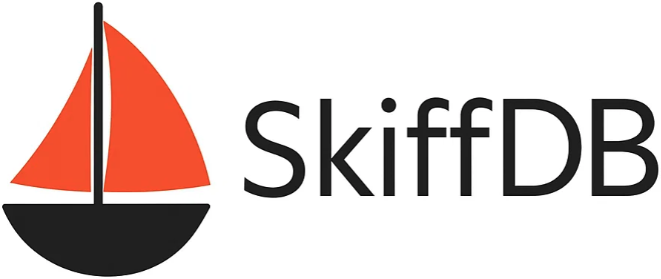

<p align="center">
  
</p>

------
Skiffdb is a lightweight, Redis-protocol (RESP) key-value store designed as a **secondary-tier cache** with **optional persistence** and **high availability (HA)**. Point existing Redis clients at it for fast reads, consistent writes, and warm restarts when you want durability.
> Status: Experimental / alpha. Core cache commands work; HA scaffolding exists; persistence is WIP.  

# Intro
## Why Skiffdb?
- Cache-first: predictable latency and memory controls (TTL & eviction) for hot paths.
- Redis-compatible subset: speak RESP so your existing clients/tools “just work.”
- Optional persistence: warm-start via snapshots and (optionally) AOF.
- HA mode: leader-based replication so writes are consistent; stale follower reads are possible for cache workloads.

## Current highlights
- RESP server with common commands (`GET`/`SET`/`DEL`/`EXPIRE`/`TTL`/`EXISTS`/`INCR`/`DECR`, simple Lists/Hashes, `PING`).
- TTLs with lazy expiration (active sweeps on the roadmap).
- Basic HA scaffolding with durable Raft log and consensus state; FSM snapshot recovery is still WIP.
- Simple in-memory engine (map + locks) — easy to hack, easy to profile.

## Getting Started
> You can run a single node (fastest way to try it) or a small HA cluster. Flags may evolve while in alpha.
### 1) Single node
```bash
# Download a release binary for your platform (example path shown)
# chmod +x ./skiffdb-server

./skiffdb-server \
  --addr=:6380 \
  --data-dir=./data \
  --maxmemory=1GB
```

Smoke test with redis-cli:
```bash
redis-cli -p 6380 PING
redis-cli -p 6380 SET hello world
redis-cli -p 6380 GET hello
redis-cli -p 6380 EXPIRE hello 5
redis-cli -p 6380 TTL hello
```

Optional health/metrics (if enabled in your build):
curl -s localhost:9090/healthz
curl -s localhost:9090/metrics | head

### 2) 3-node HA cluster (alpha)
> Basic leader/follower replication; single Raft group. Start three processes with unique IDs and addresses. Bootstrap once.
Terminal A:
```bash
./skiffdb-server \
  --addr=:6380 \
  --data-dir=./data \
  --maxmemory=1GB \
  --admin-addr=:7002 \
  --enable-raft \
  --raft-id=node-8001 \
  --raft-addr=127.0.0.1:8001
```

Terminal B:
```bash
./skiffdb-server \
  --addr=:6381 \
  --data-dir=./data \
  --maxmemory=1GB \
  --admin-addr=:7003 \
  --enable-raft \
  --raft-id=node-8002 \
  --raft-addr=127.0.0.1:8002 \
  --join=127.0.0.1:7002
```

Terminal C:
```bash
./skiffdb-server \
  --addr=:6382 \
  --data-dir=./data \
  --maxmemory=1GB \
  --admin-addr=:7004 \
  --enable-raft \
  --raft-id=node-8003 \
  --raft-addr=127.0.0.1:8003 \
  --join=127.0.0.1:7002
```

Point clients at the leader (Skiffdb will log which node is leader) for linearizable writes. Stale reads from followers may be allowed for cache workloads (depending on config).

### Raft storage and restart behavior

Raft-enabled nodes require a stable, explicit `--raft-id`. Consensus state is
stored beneath the configured data directory:

```text
<data-dir>/raft/<raft-id>/raft.db
<data-dir>/raft/<raft-id>/snapshots/
```

The node directory is created with mode `0700` and the bbolt database with mode
`0600`. bbolt holds an exclusive file lock while the node is running; a second
process using the same data directory and Raft ID fails startup after a bounded
timeout. On restart, an initialized store is reopened without bootstrapping or
joining the cluster again.

Raft log and stable-state writes use `raft-boltdb/v2` with `NoSync=false`.
Consequently, each completed bbolt write transaction synchronizes the database
file before returning to Raft. SkiffDB does not acknowledge a successful Raft
write until HashiCorp Raft reports that it is committed and applied. This policy
assumes the operating system, filesystem, and storage device honor their normal
fsync durability contract.

FSM snapshots use an atomic file-backed store with checksums. Three completed
snapshots are retained, and Raft checks every two minutes whether at least 8192
new log entries need to be snapshotted. The newest valid snapshot is restored on
restart before the remaining log tail is replayed. `SAVE` requests the same
durable Raft snapshot synchronously and reports an error unless it completes.
Graceful shutdown stops Raft first, then closes its TCP transport and bbolt
store.

### 3) Run With Config file (TOML)
You can also run with a config file:
```toml
# skiffdb.toml
[server]
bind = "0.0.0.0"
port = 6380
maxmemory = "1GB"                # enforce memory cap
eviction_policy = "allkeys-lru"  # planned: lru|lfu|ttl

[persistence]
snapshot = true                   # enable periodic RDB-like snapshot
aof = false                       # append-only file (everysec) — optional

[cluster]
enabled = false
node_id = "node-a"
raft_addr = ":7001"
bootstrap = true
join = ""                         # e.g. "127.0.0.1:7001" on non-bootstrap nodes
data_dir = "./data"
```

Run:
```bash
./skiffdb-server --config=./skiffdb.toml
```

## Build from source
### Prereqs
- Go 1.22+
- (Optional) make, redis-cli, Prometheus/Grafana for metrics

### Build
```
git clone https://github.com/fanyi-zhao/skiffdb.git
cd skiffdb

# Install dependencies
go install google.golang.org/protobuf/cmd/protoc-gen-go@latest
go install google.golang.org/grpc/cmd/protoc-gen-go-grpc@latest

# Build server
go mod tidy
go build -o skiffdb-server

# Run tests
go test ./...
```

## Roadmap
A pragmatic path to a cache-first KV with opt-in persistence and trustworthy HA.
### P0 — Make it dependable (MVP you can deploy)
#### Correctness & Ops
- [ ] TTL/Expiry engine: lazy + active sweeps; min-heap or timing-wheel.
- [ ] Memory limits & eviction: maxmemory + policies (allkeys-lru, allkeys-lfu w/ sampling).
- [ ] Command set for cache: MGET/MSET, SETEX/PEXPIRE/EXPIREAT/PTTL, variadic DEL, SCAN (cursor), INFO, ECHO.
- [ ] Networking hygiene: pipelining, backpressure, slow client handling, sane conn limits.
- [ ] Observability: Prometheus metrics (ops/latency by command, mem by type, expirations/evictions, replication lag), SLOWLOG, LATENCY LATEST, INFO.
- [ ] Security: AUTH and TLS listener.

#### Persistence (cache-friendly)
- [ ] RDB-style snapshots for fast warm start (non-blocking).
- [ ] Optional AOF (always|everysec|no) + lightweight rewrite/compaction.

#### Performance hygiene
- [ ] Sharded hashmap (e.g., 256 shards) to reduce RWMutex contention.
- [ ] Buffer reuse; avoid hot-path allocations.
- [ ] Batch log/AOF application.

### P1 — HA that operators trust
#### Replication model
- [ ] Single Raft group with durable log + stable store on disk (e.g., Pebble/Bolt).
- [ ] Leader reads (simple) + option for linearizable reads via barrier.
- [ ] Bootstrap/recovery docs; snapshot restore; node replacement.

#### Persistence experience
- [ ] Sub-minute warm restart for ~GB snapshots; bounded AOF replay (rewrite on ratio/size).
- [ ] Write-through/-behind hooks (interface only at first) for “secondary-tier” patterns.

#### Operational surface
- [ ] Config file (TOML/YAML), Docker image, Helm chart.
- [ ] Health endpoints (/healthz, /readyz), /metrics.
- [ ] Admin: CONFIG GET/SET (safe subset), SAVE, BGSAVE, guarded FLUSHDB.

#### Target SLOs (guidance)
- Single node: >200–300k GET/s and >100–150k SET/s @ 1 KiB values; p99 < 5–10 ms @ ~70% CPU on a modern box.

### P2 — Scale-out
#### A) Client-side sharding (faster to ship)
- [ ] Consistent hashing (ketama) across many 3-node shards.
- [ ] Lightweight membership/gossip and client library/sidecar.

#### B) Server-managed sharding (Redis-Cluster-like)
- [ ] 16384 slots + CLUSTER SLOTS, MOVED/ASK redirects.
- [ ] Metadata Raft group for slot→replica mapping.
- [ ] Resharding & rebalancing with online key migration.

### P3 — Differentiators
- [ ] Better hit-rates: TinyLFU/ARC; pluggable policies per namespace.
- [ ] Multi-tenant namespaces: per-tenant quotas, metrics, ACL/RBAC.
- [ ] S3/R2 snapshot sink for rapid fleet warm-ups.
- [ ] Probabilistic DS ops: Bloom/Count-Min; HLL; built-in rate limiters.
- [ ] RESP3, streams, pub/sub — only if demanded.
